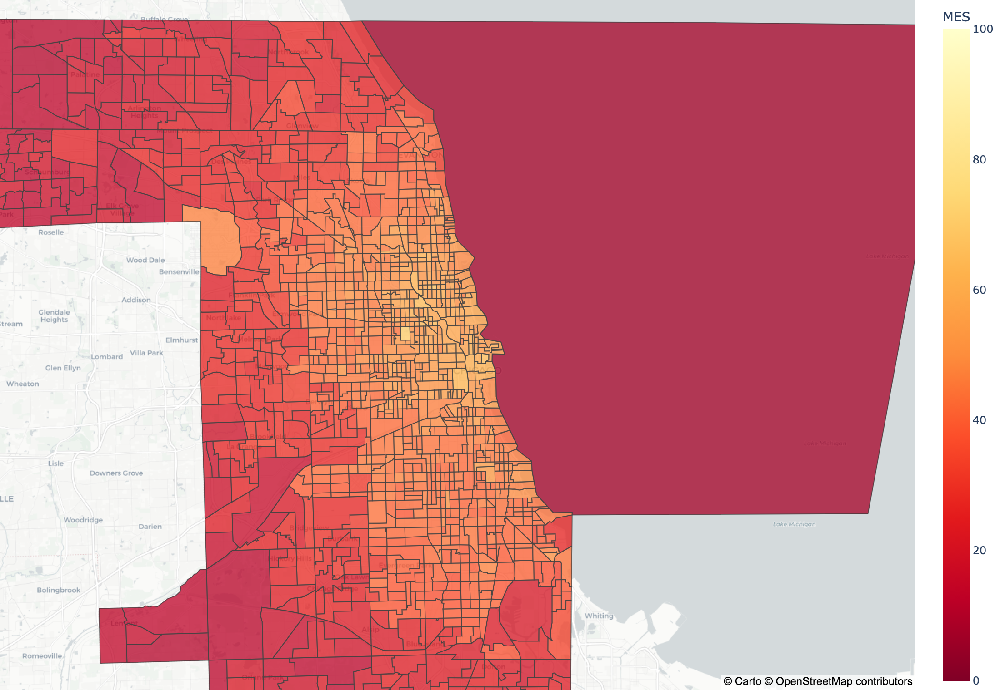
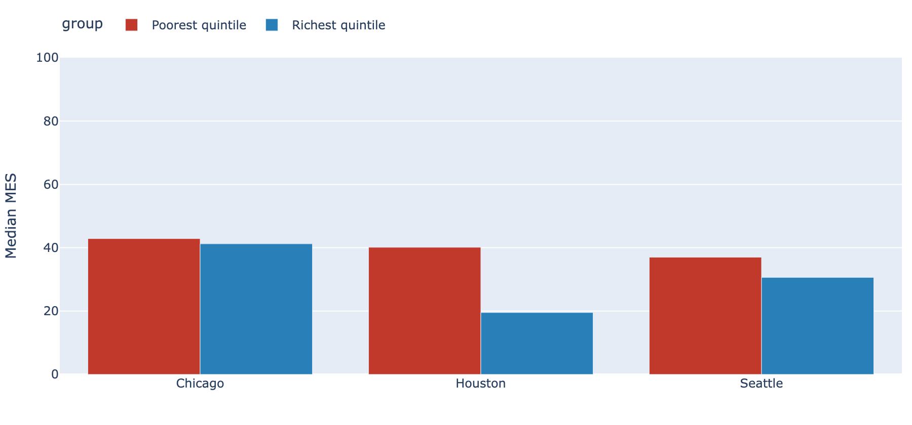
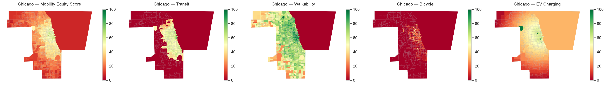

# Urban Mobility Equity Dashboard

**EMGT 7945 · Northeastern University · Summer 2026 · Aashritha Kanagala**

A data-science and visualization project that measures and maps how equitably
urban mobility infrastructure — public transit, walkability, bicycle lanes, and
EV charging — is distributed across neighborhoods (Census tracts) in U.S.
cities, and identifies the most disadvantaged areas ("mobility deserts").

The project has four components:

1. A **Python data pipeline** that collects, cleans, and processes public datasets.
2. A **Mobility Equity Score (MES)** — a composite 0–100 index at the Census-tract level.
3. An **interactive Plotly Dash dashboard** for exploring and comparing results.
4. **Statistical analysis outputs** (correlations, Moran's I, clusters, sensitivity tests).

Study cities (Phase 1): **Chicago, IL · Houston, TX · Seattle, WA**.

---

## 1. The Mobility Equity Score

For every Census tract the MES combines four normalized (0–100) sub-indices:

| Sub-index | What it measures | Source | API key? |
|-----------|------------------|--------|----------|
| **Transit** | Stop density, AM-peak frequency, service span within 0.5 mi | GTFS feeds (transit.land / agency) | transit.land (optional) |
| **Walkability** | EPA National Walkability Index, areally interpolated to tracts | EPA Smart Location Database v3 | none |
| **Bicycle** | Dedicated bike-lane km per km² | OpenStreetMap via OSMnx | none |
| **EV charging** | Public charger density per 1,000 residents + proximity to DC-fast | DOE/NREL AFDC | NREL |

```
MES = w_transit · transit_norm + w_walk · walk_norm + w_bike · bike_norm + w_ev · ev_norm
```

The baseline weights each sub-index equally (0.25). Tracts in the bottom
quartile of MES are flagged as **mobility deserts**; tracts in the bottom
quartile of ≥2 sub-indices are **compounded deserts**.

---

## 2. Installation

This project targets **Python 3.11**. The geospatial stack does not install
cleanly on Python 3.9, so use 3.11 (any install method works — the steps below
use [`uv`](https://github.com/astral-sh/uv), which installs a standalone
interpreter without admin rights).

```bash
# Option A — uv (recommended; no system Python changes)
curl -LsSf https://astral.sh/uv/install.sh | sh
uv python install 3.11
uv venv --python 3.11 .venv
uv pip install --python .venv/bin/python -r requirements.txt

# Option B — standard venv if you already have Python 3.11
python3.11 -m venv .venv
source .venv/bin/activate
pip install -r requirements.txt
```

> Note: `gtfs-functions` is pinned to 2.5 with `h3<4`; the 2.7.0 wheel on PyPI
> ships without code and 2.5 uses the legacy h3 v3 API.

---

## 3. API keys (`.env`)

The walkability and bicycle sub-indices and all tract boundaries need **no
keys**. Transit, EV charging, and ACS demographics do. Copy the template and
fill in free keys:

```bash
cp .env.example .env
```

| Variable | Used for | Get a free key |
|----------|----------|----------------|
| `CENSUS_API_KEY` | ACS demographics (equity analysis) | https://api.census.gov/data/key_signup.html |
| `NREL_API_KEY` | EV charger locations (AFDC) | https://developer.nrel.gov/signup/ |
| `TRANSITLAND_API_KEY` | GTFS feed discovery (optional; direct feed URLs are also built in) | https://www.transit.land/documentation |

Until the keyed sources are fetched, the pipeline substitutes a clearly-labelled
spatial **placeholder** for the transit, EV, and demographic layers so the
dashboard and analysis run end-to-end. Placeholder values are never presented
as measurements (see [Data status](#6-data-status)).

---

## 4. Running the pipeline

Run from the project root (the `src` package must be importable):

```bash
# 1. Boundaries (TIGER 2023 tracts + 2019 block groups)        [no key]
python -m src.data_collection.fetch_tiger

# 2. Walkability (EPA Smart Location Database)                 [no key]
python -m src.data_collection.fetch_epa

# 3. Bicycle network (OpenStreetMap)                           [no key]
python -m src.data_collection.fetch_osm

# 4a. EV charging from OpenStreetMap (no key — key-free AFDC alternative)
python -m src.data_collection.fetch_osm_ev

# 4b. Demographics / EV / transit (need keys; safe to skip)
python -m src.data_collection.fetch_census   # CENSUS_API_KEY (real ACS demographics)
python -m src.data_collection.fetch_afdc      # NREL_API_KEY (authoritative EV; overrides OSM)
python -m src.data_collection.fetch_gtfs      # transit; Chicago/Seattle key-free, Houston needs a token

# 5. Build sub-indices, then the MES GeoJSONs
python -m src.processing.build_subindices
python -m src.processing.build_mes

# 6. Statistical analysis + report figures
python -m src.analysis.run_analysis
```

Outputs land in `data/processed/` (sub-indices, MES GeoJSONs) and
`data/outputs/` (CSV tables and `figures/` PNGs for the report).

---

## 5. Launching the dashboard

```bash
python -m src.dashboard.app
# open http://127.0.0.1:8050
```

Panels: a tract-level choropleth (MES or any sub-index), a click-through side
panel (score, percentile, sub-index bars vs the city median, auto-generated
interpretation, demographics), a city equity-gap comparison (poorest vs richest
income quintile), a ranked table of the most disadvantaged tracts, and CSV
downloads.

### Screenshots

Chicago Mobility Equity Score (darker red = worse access):



Equity-gap panel — median MES of the poorest vs richest income quintile per city
(*shown with placeholder demographics; run `fetch_census` for real ACS values*):



Static multi-panel choropleth for the report (MES + four sub-indices), e.g. Chicago:



---

## 6. Data status

Each MES GeoJSON records whether each layer is measured or placeholder. Current
status:

| City | Transit | Walk | Bike | EV | Demographics |
|------|---------|------|------|----|--------------|
| Chicago | ✅ GTFS (CTA) | ✅ EPA | ✅ OSM | ✅ OSM | ✅ ACS |
| Houston | ✅ GTFS (METRO) | ✅ EPA | ✅ OSM | ✅ OSM | ✅ ACS |
| Seattle | ✅ GTFS (KCM) | ✅ EPA | ✅ OSM | ✅ OSM | ✅ ACS |

**All three cities are fully real across every dimension.** Houston transit is
resolved via the Mobility Database API (set `MOBILITYDB_REFRESH_TOKEN` in `.env`;
RideMetro no longer publishes a key-free direct feed). The EV layer uses
OpenStreetMap charging points (key-free) as a lower-bound proxy; run
`fetch_afdc.py` with an `NREL_API_KEY` on a network that can reach
`developer.nrel.gov` for the authoritative AFDC inventory, then re-run steps 5–6.

---

## 7. Repository structure

```
urban-mobility-equity/
├── data/
│   ├── raw/         # downloaded source data (gitignored when large)
│   ├── processed/   # sub_indices/, mes_scores/, demographics
│   └── outputs/     # tables + figures/ for the report
├── notebooks/       # 01–09, one per pipeline / analysis stage
├── src/
│   ├── data_collection/   # fetch_{tiger,census,epa,osm,afdc,gtfs}.py
│   ├── processing/        # {transit,walk,bike,ev}_index, normalizer, mes_builder, build_*
│   ├── analysis/          # correlation, spatial autocorrelation, clustering, weighting, sensitivity
│   └── dashboard/         # app, layout, callbacks, utils
└── tests/           # pytest unit tests
```

---

## 8. Data sources & licenses

- **U.S. Census TIGER/Line & ACS 5-year (2019–2023)** — public domain.
- **EPA Smart Location Database v3 (Jan 2021)** — U.S. Government open data.
- **OpenStreetMap** — © OpenStreetMap contributors, ODbL.
- **DOE/NREL Alternative Fuels Data Center** — U.S. Government open data.
- **GTFS feeds** — per transit agency terms (CTA, Houston METRO, King County Metro).

## 9. Testing

```bash
python -m pytest tests/ -q
```
